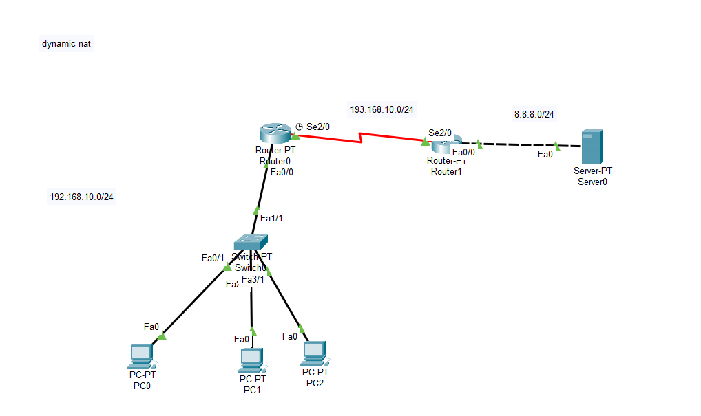
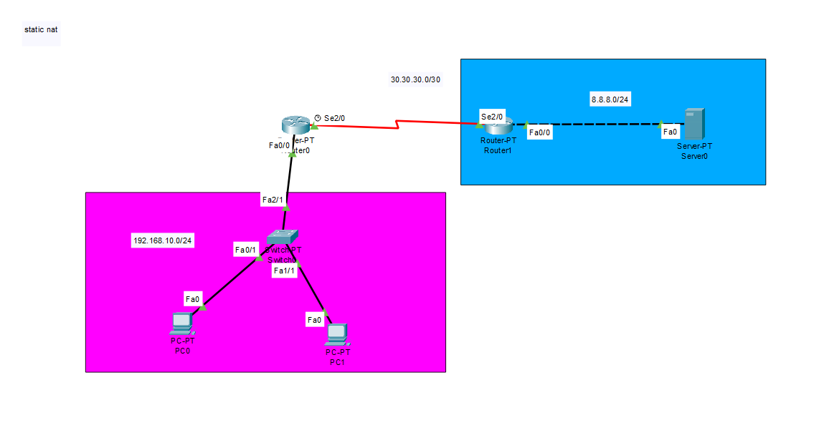
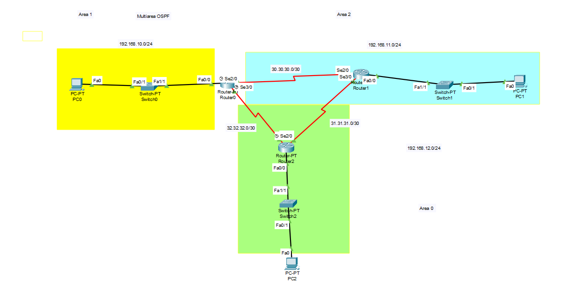

# Cisco Packet Tracer Networking Projects

This repository contains three Cisco Packet Tracer lab projects demonstrating core networking concepts: **Dynamic NAT**, **Static NAT**, and **Multiarea OSPF**.

## 📁 Projects

### 1. Dynamic NAT

Demonstrates Network Address Translation (NAT) using a dynamic address pool, allowing multiple internal hosts to share a pool of public IP addresses when accessing external networks.

**Topology:**
- **Router0** (Fa0/0 → Switch0, Se2/0 → Router1)
- **Switch0** connects PC0, PC1, PC2
- **Router1** (Se2/0 → Router0, Fa0/0 → Server0)
- **Server0** (external network)

**Networks:**
| Network | Description |
|---|---|
| 192.168.10.0/24 | Internal LAN (PC0, PC1, PC2) |
| 193.168.10.0/24 | Serial link (Router0 ↔ Router1) |
| 8.8.8.0/24 | External network (Server0) |

**Key Concepts:** NAT pool configuration, inside/outside interfaces, access-list based translation.

---

### 2. Static NAT

Demonstrates a one-to-one static NAT mapping between an internal private IP and a public IP address.

**Topology:**
- **Router0** (Fa0/0 → Switch0, Se2/0 → Router1)
- **Switch0** connects PC0, PC1
- **Router1** (Se2/0 → Router0, Fa0/0 → Server0)
- **Server0** (external network)

**Networks:**
| Network | Description |
|---|---|
| 192.168.10.0/24 | Internal LAN (PC0, PC1) |
| 30.30.30.0/30 | Serial link (Router0 ↔ Router1) |
| 8.8.8.0/24 | External network (Server0) |

**Key Concepts:** Static one-to-one NAT translation, inside/outside interface configuration.

---

### 3. Multiarea OSPF

Demonstrates OSPF routing across multiple areas (Area 0, Area 1, Area 2) with three routers connected in a triangular topology.

**Topology:**
- **Router0** — Area 1 (Fa0/0 → Switch0 → PC0)
- **Router1** — Area 2 (Fa0/0 → Switch1 → PC1)
- **Router2** — Area 0 / backbone (Fa0/0 → Switch2 → PC2)
- Serial links connect all three routers in a full mesh

**Networks:**
| Network | Description |
|---|---|
| 192.168.10.0/24 | Area 1 LAN (PC0) |
| 192.168.11.0/24 | Area 2 LAN (PC1) |
| 192.168.12.0/24 | Area 0 LAN (PC2) |
| 30.30.30.0/30 | Router0 ↔ Router1 |
| 31.31.31.0/30 | Router1 ↔ Router2 |
| 32.32.32.0/30 | Router0 ↔ Router2 |

**Key Concepts:** OSPF multi-area design, backbone area (Area 0), inter-area route propagation.

---

## 🛠️ Tools Used
- Cisco Packet Tracer

## 📂 Repository Structure
